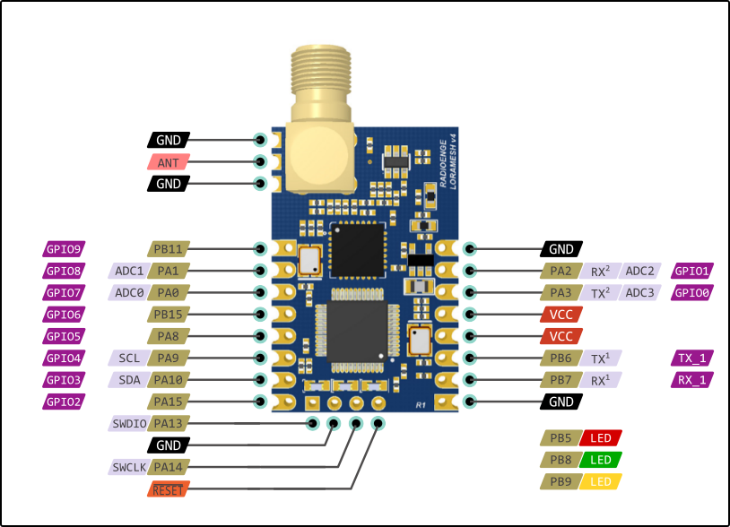
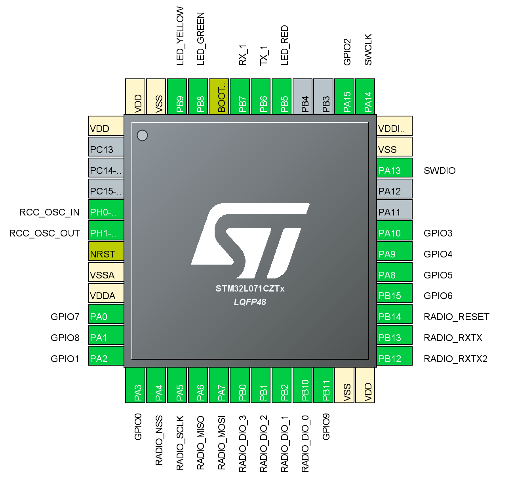

# RadioEnge Module

This is a reverse engineering project to make possible to program the RadioEnge LoRa Module on the Arduino IDE using [Arduino_Core_STM32](https://github.com/stm32duino/Arduino_Core_STM32).

* This board works stable with [Arduino_Core_STM32 v1.8.0](https://github.com/stm32duino/Arduino_Core_STM32/releases) and [STM32 - arduino-lmic v3.1.0](https://github.com/ricaun/arduino-lmic).

## Board

The board use the `stm32l071cz` mcu with the `sx1272` lora module, the pins connections is like the image below.

## Pinouts 

This image shows the pins of the mcu.

## Arduino IDE

It's possible to burn and create your firmware using the Arduino IDE using the [Arduino_Core_STM32](https://github.com/stm32duino/Arduino_Core_STM32). Is not possible to burn the firwmare using the Serial, the BOOT0 pin is not accessible in this board, but is possible to use the SWD to programing the mcu, you need ST-LINK to do the job.

You need to install the [STM32Cube MCU Packages](https://www.st.com/en/embedded-software/stm32cube-mcu-packages.html) or [STM32CubeProg](https://www.st.com/content/st_com/en/products/development-tools/software-development-tools/stm32-software-development-tools/stm32-programmers/stm32cubeprog.html) to be able to erase the original firmware, the original firmware is not available to re-burn, this process is irreversible.

After installing the STM32CubeProgrammer, connect the ST-LINK. if your ST-LINK is new the STM32CubeProgrammer probably gonna update the ST-LINK firmware.

Next, you need to connect the GND, SWDIO, SWCLK, and VCC of the ST-LINK to the Radioenge module, check the pinout of the module, you need to solder some pins to make easier. 

If you connect everything and tries to connect to the device you should get some error.

You need to hold the reset pin to the GND and press to connect, then pull off the reset.

The connection should be a success.

Now you need to go on the OB (Option Bytes) and find the Read Out Protection (RDP) the value should be BB. Change to AA to remove the protection and press Apply. The board should be erased and is ready to work with the Arduino IDE.

### What board

The [STM32Cube MCU Packages](https://www.st.com/en/embedded-software/stm32cube-mcu-packages.html) does not have the exactly mcu (stm32l071cz), but is possible to use some similar to make works.

You can use the `stm32l073`, the pinout is really similar and should work like a charm.

Select the board `Nucleo-64` and board part number `Nucleo L073RZ`. You need to change the upload method to 
`STM32CubeProgrammer (SWD)`.

Now is possible to burn some blick example. 

Default Serial is on the pins GPIO0 and GPIO1.

### Pinout - IOs

<pre>
#define RX_1	                PB7
#define TX_1	                PB6

#define GPIO0	                PA3
#define GPIO1	                PA2
#define GPIO2	                PA15
#define GPIO3	                PA10
#define GPIO4	                PA9
#define GPIO5	                PA8
#define GPIO6	                PB15
#define GPIO7	                PA0
#define GPIO8	                PA1
#define GPIO9	                PB11

#define LED_RED                 PB5
#define LED_GREEN               PB8
#define LED_YELLOW              PB9
</pre>

## LoRa

<b>The original lmic part is a little unstable, `noInterrupt()` break the program and stops working.</b>

You need to download my version of the [arduino-lmic v3.1.0](https://github.com/ricaun/arduino-lmic) library.

Remember you need to change the config file of the lmic library and define `CFG_sx1272_radio`.

### Pinout - Radio LoRa

<pre>
#define RADIO_RESET_PORT        PB14
#define RADIO_MOSI_PORT         PA7
#define RADIO_MISO_PORT         PA6
#define RADIO_SCLK_PORT         PA5
#define RADIO_NSS_PORT          PA4

#define RADIO_DIO_0_PORT        PB10
#define RADIO_DIO_1_PORT        PB2
#define RADIO_DIO_2_PORT        PB1
#define RADIO_DIO_3_PORT        PB0

#define RADIO_RXTX_PORT         PB13
#define RADIO_RXTX2_PORT        PB12
</pre>

### LMIC

#### lmic_project_config.h

<pre>
#define CFG_au915 1
#define CFG_sx1272_radio 1
</pre>

#### lmic_pinmap
<pre>
const lmic_pinmap lmic_pins = {
  .nss = RADIO_NSS_PORT,
  .rxtx = RADIO_RXTX_PORT,
  .rst = RADIO_RESET_PORT,
  .dio = {RADIO_DIO_0_PORT, RADIO_DIO_1_PORT, RADIO_DIO_2_PORT},
  .rxtx_rx_active = 1,
};
</pre>

#### setup

<pre>
pinMode(RADIO_RXTX2_PORT, OUTPUT);
digitalWrite(RADIO_RXTX2_PORT, LOW);
</pre>

----

See news and other projects about LoRa on my [blog](http://loranow.com).
